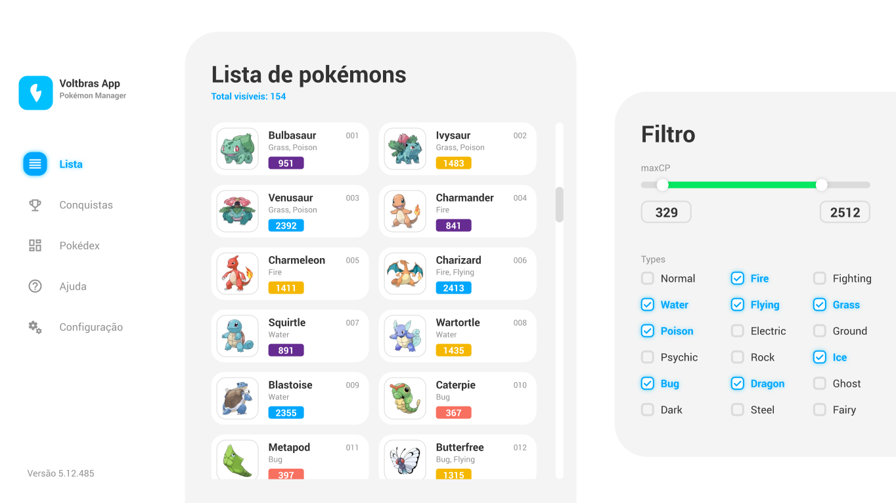

<h1 align="center">
    
</h1>

<p align="center">
  Um visualizador de pokémons
</p>

------------

<p align="center">
    <a href="https://github.com/Goytai/PokemonManager/blob/master/LICENSE">
        
    </a>
    <a href="https://goytai-pokemons.vercel.app/">
        
    </a>
</p>

------------
<h2>📖 Sobre</h2>

Projeto proposto pela <a href="https://voltbras.com.br/">Voltbras</a> ⚡ para processo de seleção de desenvolvedores.

------------
<h2>🧪 Tecnologias</h2>

O projeto foi desenvolvido utilizando:

&rarr; <a href="https://reactjs.org">React</a> <br>
&rarr; <a href="https://www.typescriptlang.org/">TypeScript</a> <br>
&rarr; <a href="https://styled-components.com/">StyledComponent</a> <br>
&rarr; <a href="https://www.apollographql.com/">Apollo Client</a> <br>

------------
<h2>🖥️ Live Preview</h2>

O live preview está disponível em:

<p align="center">
    <a href="https://goytai-pokemons.vercel.app/">
        
    </a>
</p>

------------
<h2>🔌 Getting started</h2>

Faça o clone do projeto:

```bash
$ git clone https://github.com/Goytai/PokemonManager.git
```

Acesse a pasta do projeto:

```bash
$ cd PokemonManager
```

Instale as dependências:
```bash
$ yarn
```

Crie o arquivo ``.env`` na raiz do projeto e defina a url para conexão com a API na variável de ambiente chamado ``REACT_APP_CLIENT``. Por exemplo:
```env
REACT_APP_CLIENT=http://api.example.com/
```

>⚠️ Essa configuração é fundamental para o funcionamento da aplicação.

Inicie o projeto:
```bash
$ yarn start
```

------------
<h2>📝 Licença</h2>

Este projeto está licenciado sob a Licença MIT. Consulte o arquivo de <a href="https://github.com/Goytai/PokemonManager/blob/master/LICENSE">LICENSE</a> para obter mais detalhes.

------------
<p align="center">
    <a href="https://github.com/Goytai">
        
    </a>
    <a href="https://www.linkedin.com/in/goytai/">
        
    </a>
    <a href="mailto:dev.goytai@gmail.com">
        
    </a>
</p>
<p align="center">Feito com 💜 por Goytai</p><br>
